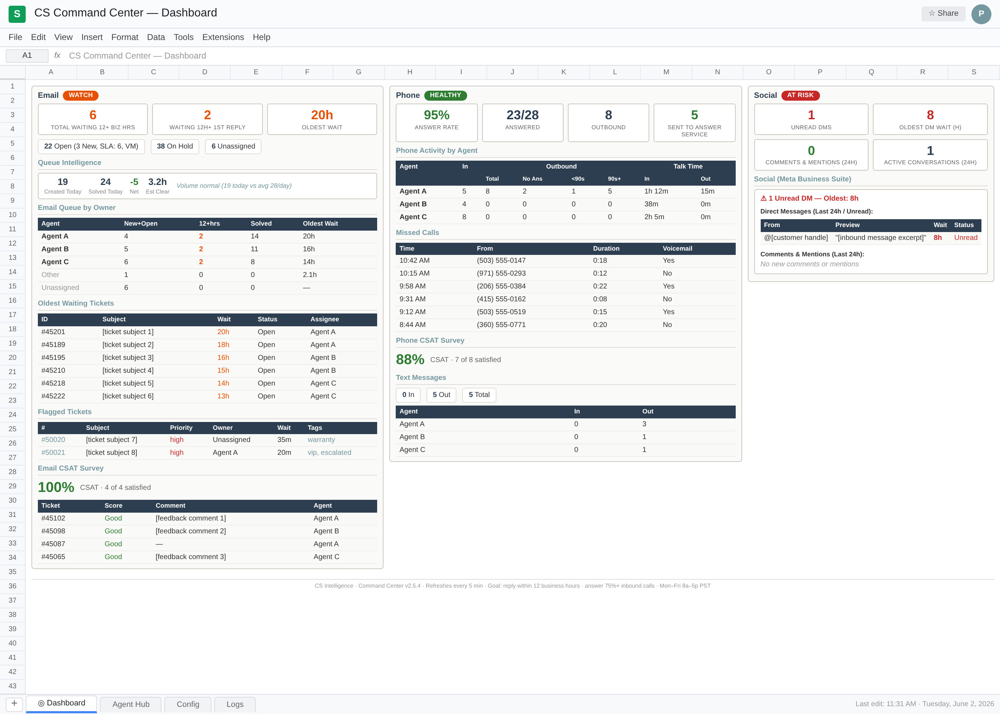
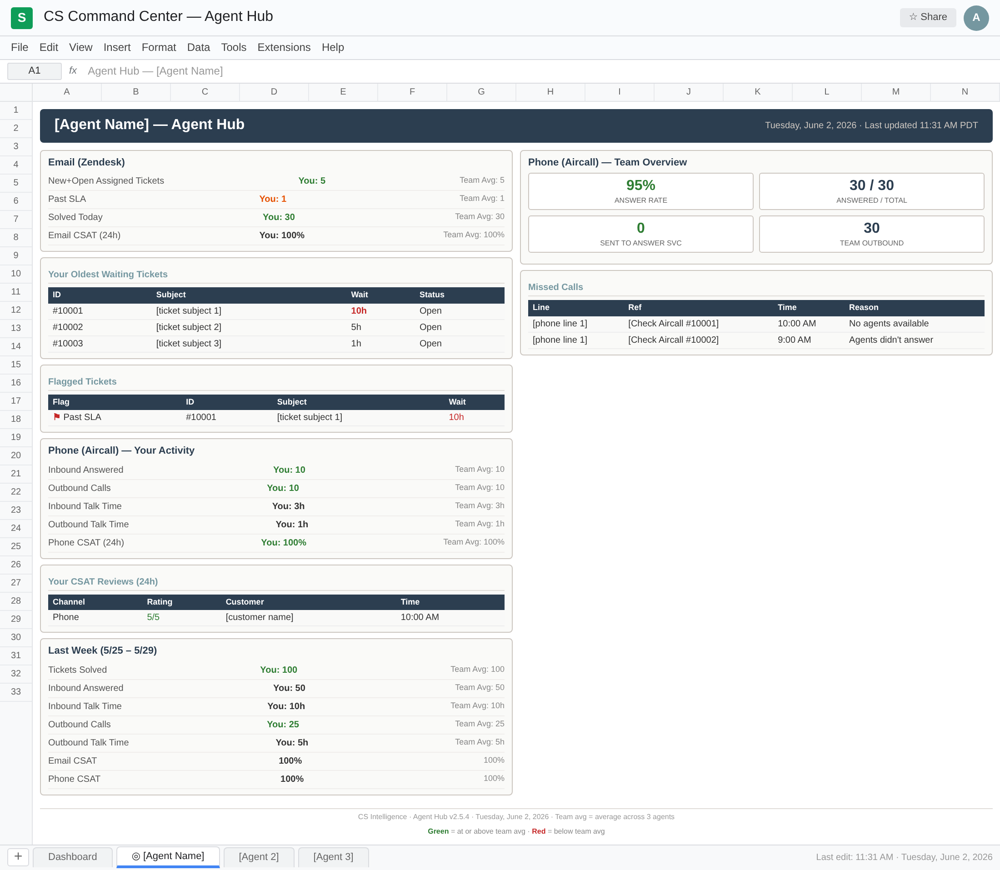
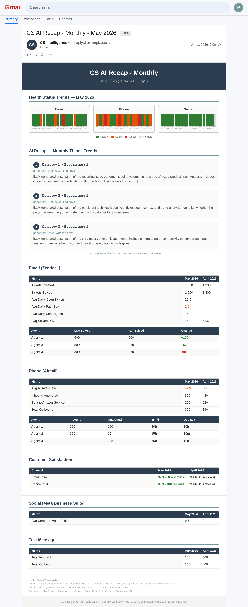

# CS Intelligence Platform

AI-powered customer support intelligence built on Google Apps Script. Unifies your ticket system, phone platform, CSAT tools, and social channels into a single operational view - then uses an LLM to tell you what your customers are actually saying.

Real-time dashboard. Per-agent performance metrics. Automated daily, weekly, and monthly email summaries with theme analysis and sentiment classification. One file. Zero new vendors.

## The problem

Most CS teams run best-in-class tools for each channel - a ticket system, a phone platform, a CSAT provider, a social inbox. Each tool is great at what it does. But each ships with its own dashboard, its own KPI definitions, and its own walled garden.

That creates two gaps:

- **Operations** - there's no single place to see queue health, SLA compliance, agent workload, and customer satisfaction across channels simultaneously. Reporting from each tool uses different underlying rules, so metrics don't reconcile across sources. You end up checking four dashboards and still not knowing where to deploy resources.

- **Signal** - every ticket contains information about what customers are actually experiencing: product issues, recurring failures, emerging patterns. That signal is invisible at scale. No one has time to read every ticket, so the intelligence just sits there.

## The solution

A single Google Apps Script file that connects to your support APIs and closes both gaps. No infrastructure to manage, no vendor to evaluate, no budget to approve - it runs inside Google Sheets.

Three products, one codebase:

### Command Center

Real-time operations dashboard. Refreshes every 5 minutes. Email queue health, phone answer rates, social DM response times, CSAT scores, per-agent workload, and AI-powered volume spike detection - all in one view with configurable health indicators (Healthy / Watch / At Risk) per channel.



### Agent Hub

Personal performance dashboard for each CS agent. Current queue (assigned tickets, past SLA, oldest waiting), today's activity across email and phone, CSAT reviews, and last week's stats benchmarked against the team average. Agents can self-prioritize and self-assess without asking a manager for a report.



### AI Recap

Automated email summaries powered by Claude AI. Four cadences:

- **Daily** - end-of-day snapshot with channel health badges, the top 3 customer themes identified by AI (with representative quotes and direct ticket links), per-agent stats, and comparison to the previous working day
- **Weekly** - Customer Kudos (top CSAT quotes selected by AI), health trend charts, theme trend analysis, full metrics with week-over-week deltas
- **Monthly** - health trends across the full month, theme trends with ticket volume and customer tone analysis, per-agent performance with month-over-month deltas, feature request aggregation
- **Non-working day** - lightweight queue snapshot so you know what's waiting Monday morning



The AI layer identifies the top 3 patterns across all tickets and calls each day, classifies customer sentiment per ticket, and surfaces representative quotes - turning raw volume into a narrative a manager can act on in 30 seconds.

## What it can track

The current implementation integrates with Zendesk, Aircall, Nicereply, Meta Business Suite, and the Anthropic API. The pattern is adaptable to other tools in each category.

**Tickets** - open count, on hold, unassigned, SLA compliance (configurable business hours), per-agent assigned/past SLA/solved, oldest waiting with direct links, flagged tickets (priority, warranty, escalated), tickets created, voicemails

**Phone** - answer rate (business hours only), per-agent inbound/outbound with talk time, missed calls with reason detection, text message activity per agent

**Social** - DMs across platforms (merged, tagged by source), unread count with conversation excerpts, comments and mentions, deep links to inbox, token expiry monitoring

**Customer satisfaction** - email CSAT and phone CSAT with per-agent attribution, individual review detail with ticket links

**AI analysis** - daily top 3 themes via Claude, customer sentiment classification (Neutral / Frustrated / Angry), weekly and monthly trend aggregation from historical theme data, volume spike detection with AI-generated context

**Health indicators** - per-channel health status (email, phone, social) based on configurable thresholds, tracked historically for trend visualization

## Tech stack

- **Runtime**: Google Apps Script (V8)
- **UI**: Google Sheets (formatted programmatically, no add-ons)
- **Data layer**: Google Sheets (Daily Metrics Log, Daily Themes Log, Health Badge Log)
- **AI**: Anthropic Claude Haiku with prompt caching
- **Email delivery**: Gmail (HTML emails via GmailApp)
- **Auth**: API tokens in Script Properties (never in code)
- **Scheduling**: Apps Script time-driven triggers (5-min dashboard, daily/weekly/monthly emails)
- **Dependencies**: None. Single file, no build step, no external libraries

## Architecture

```
                          ┌────────────────────────────┐
                          │    LLM API (Claude Haiku)   │
                          └──────────────┬─────────────┘
                                         │
   ┌────────────┐  ┌────────────┐        │        ┌────────────┐  ┌────────────┐
   │ Tickets API│  │  Phone API │        │        │  CSAT API  │  │ Social API │
   └─────┬──────┘  └─────┬──────┘        │        └─────┬──────┘  └─────┬──────┘
         │               │               │              │               │
         └───────────────┴───────────────┼──────────────┴───────────────┘
                                          │
                   ┌──────────────────────▼──────────────────────┐
                   │            Google Apps Script                │
                   │          (single file, ~9,400 LOC)           │
                   └──────────────────────┬──────────────────────┘
                                          │
                  ┌───────────────────────┴───────────────────────┐
                  │                                               │
   ┌──────────────▼───────────────┐         ┌─────────────────────▼──────────────────┐
   │         Google Sheets         │         │                 Gmail                   │
   │  Dashboard, Agent Hub,        │         │  Daily recap, Weekly summary,           │
   │  Metrics Log, Themes Log,     │         │  Monthly report, Non-working day        │
   │  Health Badges                │         │  snapshot                               │
   └──────────────────────────────┘         └─────────────────────────────────────────┘
```

The script runs on a 5-minute trigger for the dashboard and scheduled triggers for emails. Each dashboard refresh pulls fresh data from all APIs, processes it, and overwrites the sheet via a staging buffer to prevent flicker. The email recaps aggregate from data layer sheets that accumulate over time, giving trend analysis its historical context.

## Getting started

This implementation connects to Zendesk, Aircall, Nicereply, and Meta Business Suite. To adapt it to your stack, you'd swap the API fetch functions - the dashboard rendering, email generation, and AI analysis layers are tool-agnostic.

1. Open a new Google Sheet
2. Go to **Extensions > Apps Script**
3. Paste `cs_command_center_apps_script_v2.js` into `Code.gs`
4. Add your API credentials in **Project Settings > Script Properties**
5. Run `initializeSheet`, then `setupTrigger`
6. For email recaps, run `setupEmailTriggers`

### Configuration

All configuration is in the `CONFIG` object at the top of the script: agent names, excluded users, phone lines, business hours, SLA thresholds, email recipients. Health status thresholds (Healthy / Watch / At Risk) are stored in Script Properties and can be tuned per deployment.

## Known limitations

- **Queue state metrics** are point-in-time snapshots, so weekly/monthly averages only cover days where the dashboard was running
- **AI theme analysis** requires an Anthropic API key; without it, everything else still works but theme sections are skipped
- **Social DM tokens** expire and need periodic refresh (the dashboard monitors expiry and warns at 7 days)

## Security

All API credentials and thresholds live in Script Properties - never in the source code. The committed file contains no secrets and no customer data.
